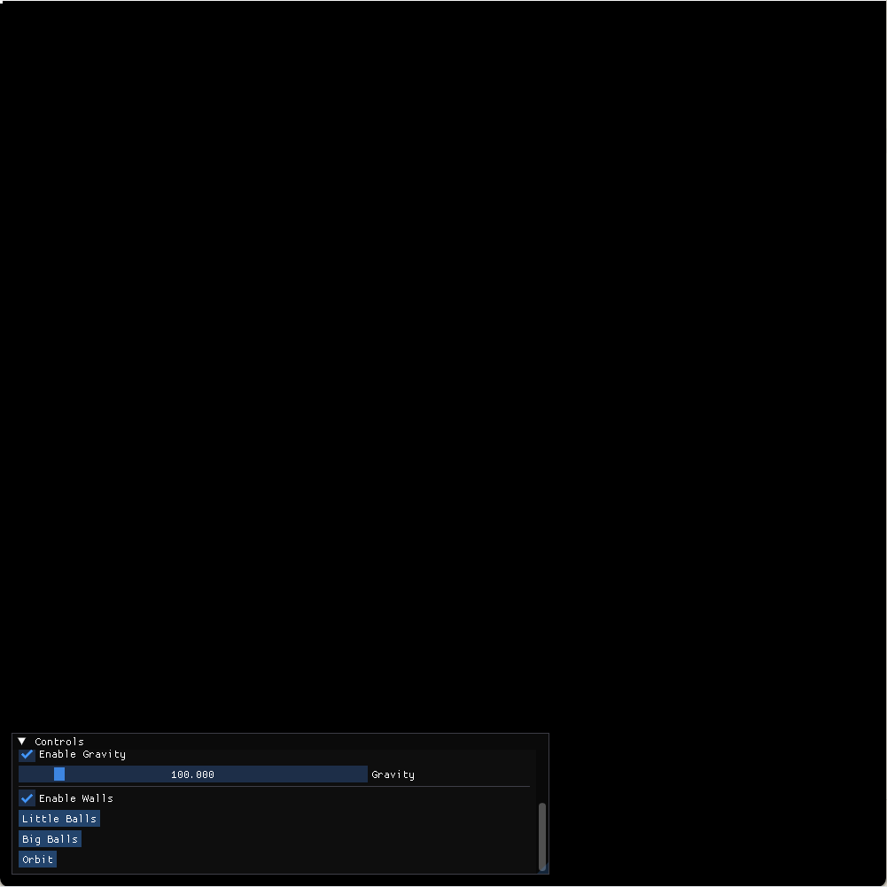

# Learning Projects 

## Balls

It (somewhat) accurately simulates multi-body gravity equations. Some of the more interesting parts is the collision-energy loss mitigation strategies I've implemented. I did no research on this topic; everything here is of my own design.

I validated my approach by calculating the center-of-mass and total energy of the system (kinetic + potential); the center-of-mass does remain stationary - the system seems to be symmetric - but the system is slightly lossy energy-wise unfortunately.

### Collision Strategies

We're using discrete time updates; because of this there is a frame where the entities are not colliding, and then there's a frame were they are. On the frame of collision they will most likely overlap - this obviously cannot happen in the real world for inflexible objects. 

I didn't really know how to handle this elegantly. My first thought would be to turn back the clock, reversing the movement all other entities until the two colliding entities just touch to perform the collision calculation at the correct time? But with accelerating velocities that seemed... a touch above my pay grade. Maybe it's possible. 

Instead, I simply moved the balls apart by an amount proportional to the incoming velocity instantly. This means they *slow down* in relation the the rest of the simulation. I believe this the source of the kinetic energy leak.

### Controls

1. Drag  is constantly applied the the velocity, any value greater than zero will slow the objects down. You can also experiment with negative drag.
2. Elasticity is applied on collisions, `1` being perfectly elastic. 
3. Camera x/y moves the midpoint of the viewport around. 
4. Enable/disable gravity.
5. Enable/disable walls. Walls are perfectly elastic, and break the symmetries required for the center-of-mass/total energy calculations. 
6. Little balls / Big balls / Orbit presets

### Examples

Example One: High drag on the little balls. You can see how the system falls into the lowest energy state (a big ball); much like how planets are formed. 

Example Two: The orbit preset. The green ball is massive compared to the red (x50000), but notice the small procession of the green ball as the much smaller mass influences it.

## PID

I created a simple PID controller for a ball to follow the mouse.